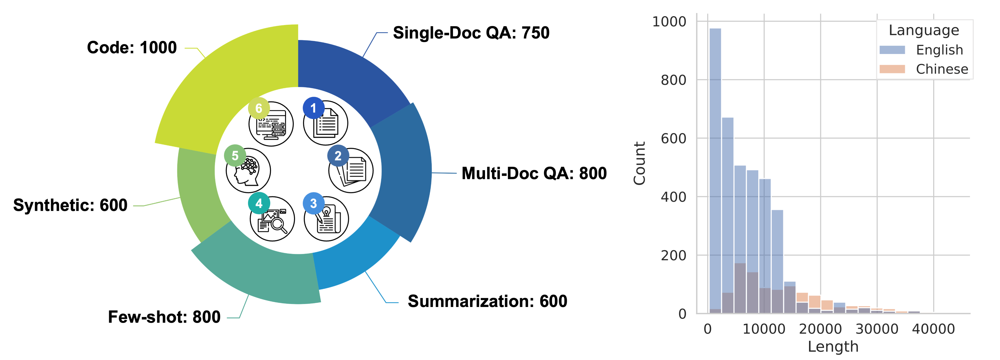
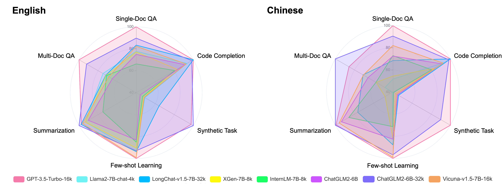
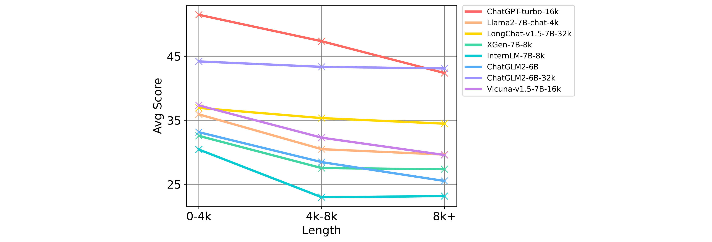

<p align="center">
    🤗 <a href="https://huggingface.co/datasets/THUDM/LongBench" target="_blank">HF Repo</a> • 📃 <a href="https://arxiv.org/abs/2308.14508" target="_blank">Paper</a>
</p>

Read this in [English](README.md).

# 📖 LongBench: 多任务中英双语长文本理解评测基准

**LongBench**是第一个多任务、中英双语、针对大语言模型**长文本理解能力**的评测基准。在目前大模型多语言能力引起广泛关注的背景下，LongBench涵盖了不同的语言（中文和英文），以此来对大模型在长文本下的多语言能力进行更全面的评估。同时，LongBench由六大类、二十一个不同的任务组成，覆盖了单文档QA、多文档QA、摘要、Few-shot学习、合成任务和代码补全等关键的长文本应用场景。

我们深知模型评测过程中可能产生的高昂成本，尤其是长文本场景下（如人工标注成本或API调用成本）。因此，我们采用了一种全自动的评测方式，旨在以最低的成本，最有效地衡量和评估模型的长文本理解能力。

LongBench包含14个英文任务、5个中文任务和2个代码任务，多数任务的平均长度在5k-15k之间，共包含4750条测试数据。关于LongBench数据集的具体统计及任务构造方式请参考[这里](task_zh.md)。此外，我们还通过均匀采样得到了长度分布更均匀的测试集合LongBench-E，在0-4k、4k-8k、8k+长度区间内的数据量相当，以提供模型在不同长度下性能变化的分析。


|   任务类型   | 英文任务数 | 中文任务数 | 代码任务数 |
| :----------: | :--------: | :--------: | :--------: |
|   单文档QA   |     3      |     1      |     -      |
|   多文档QA   |     3      |     1      |     -      |
|     摘要     |     3      |     1      |     -      |
| Few-shot学习 |     3      |     1      |     -      |
|   合成任务   |     2      |     1      |     -      |
|   代码补全   |     -      |     -      |     2      |

## 🔥 更新信息
**[2023/10/30]** 新的[ChatGLM3-6B-32k](https://huggingface.co/THUDM/chatglm3-6b-32k) chat模型已经发布，它更擅长长文本建模，尤其是基于长文档的问答、推理和总结。请在LongBench上查看其[性能](#排行榜)。

**[2023/08/29]** [LongBench论文](https://arxiv.org/abs/2308.14508)发布，同时对LongBench进行了以下几项重要更新：
1. **更全面的数据集**：在摘要任务中增加了多文档摘要MultiNews数据集，在Few-shot学习任务中增加了摘要任务SAMSum，代替之前的QA任务NQ，并对TriviaQA, RepoBench-P进行重新采样以保证数据长度更加合适；
2. **更均匀的长度分布**：根据长度进行均匀采样得到了LongBench-E，其包含LongBench中的13个长度分布更加均匀的英文数据集，LongBench-E在0-4k，4-8k，8k+长度区间内均有数量相当的测试数据，更加适合评价模型在不同输入长度上的能力变化；
3. **全部评测代码公开**：评测所有模型的代码已公开，同时提供了基于检索、分段摘要的长文本压缩策略代码。

## 🔍 目录
- [🖥️ 排行榜](#排行榜)
- [⚙️ 如何在LongBench上评测模型](#如何在LongBench上评测模型)
- [📊 详细评测结果](#详细评测结果)
- [📄 致谢](#致谢)
- [📝 引用](#引用)

<a name="排行榜"></a>
## 🖥️ 排行榜
我们在这里展示了所有模型在Zero-shot场景下，在中文和英文各大类任务上得分的平均值（%），各任务评估所用指标请参考[这里](task_zh.md)。

> 注：对于超出模型处理长度能力的文本，参考[Lost in the Middle](https://arxiv.org/abs/2307.03172)的观察，我们从文本中间进行截断，保持前后部分的信息。实验表明，这种截断方式对模型性能影响最小。

#### 英文榜单
|     | Avg | 单文档QA | 多文档QA | 摘要 | Few-shot学习 | 代码补全 | 合成任务 |
| --- | :-: | :-: | :-: | :-: | :-: | :-: | :-: |
| GPT-3.5-Turbo-16k | 44.0 | 39.8 | 38.7 | 26.5 | 67.1 | 54.1 | 37.8 |
| Llama2-7B-chat-4k | 31.0 | 24.9 | 22.6 | 24.7 | 60.0 | 48.1 | 5.9 |
| LongChat-v1.5-7B-32k | 34.3 | 28.7 | 20.6 | 26.7 | 60.0 | 54.1 | 15.8 |
| XGen-7B-8k | 28.3 | 24.6 | 20.4 | 24.7 | 56.2 | 38.6 | 5.3 |
| InternLM-7B-8k | 24.2 | 17.4 | 20.2 | 16.1 | 50.3 | 36.4 | 4.5 |
| ChatGLM2-6B-32k | 40.9 | 32.9 | 33.7 | 27.6 | 59.1 | 52.7 | 39.2 |
| Vicuna-v1.5-7B-16k | 31.9 | 28.0 | 18.6 | 26.0 | 66.2 | 47.3 | 5.5 |
| ChatGLM3-6B-32k | 48.5 | 40.3 | 46.6 | 29.5 | 68.1 | 56.2 | 50.5 |

#### 中文榜单
|       | Avg | 单文档QA | 多文档QA | 摘要 | Few-shot学习 | 代码补全 | 合成任务 |
|-------|:---:|:-------------:|:------------:|:-------------:|:-----------------:|:---------------:|:----------------:|
| GPT-3.5-Turbo-16k | 44.5 | 61.2 | 28.7 | 16.0 | 29.2 | 54.1 | 77.5 |
| Llama2-7B-chat-4k | 14.3 | 11.9 | 5.2 | 0.2 | 19.8 | 48.1 | 0.5 |
| LongChat-v1.5-7B-32k | 23.9 | 29.1 | 19.5 | 9.9 | 23.2 | 54.1 | 7.6 |
| XGen-7B-8k | 15.1 | 14.8 | 11.0 | 2.2 | 20.5 | 38.6 | 3.5 |
| InternLM-7B-8k | 18.3 | 33.6 | 11.1 | 12.4 | 15.2 | 36.4 | 0.9 |
| ChatGLM2-6B-32k | 41.7 | 51.6 | 37.6 | 16.2 | 27.7 | 52.7 | 64.5 |
| Vicuna-v1.5-7B-16k | 26.4 | 43.0 | 19.3 | 15.1 | 28.8 | 47.3 | 5.0 |
| ChatGLM3-6B-32k | 52.8 | 62.3 | 44.8 | 17.8 | 42.0 | 56.2 | 94.0 |

#### 长文本任务能力雷达图


#### 不同长度文本下的能力变化
为了更有针对性地分析模型在不同文本长度下的表现，下图展示了模型在LongBench-E中不同文本长度区间上，所有任务上按照任务类别进行平均的总分。



<a name="如何在LongBench上评测模型"></a>
## ⚙️ 如何在LongBench上评测模型

#### 载入数据
你可以通过Hugging Face datasets来下载并载入**LongBench**的数据（[🤗 HF Repo](https://huggingface.co/datasets/THUDM/LongBench)）:
```python
from datasets import load_dataset

datasets = ["narrativeqa", "qasper", "multifieldqa_en", "multifieldqa_zh", "hotpotqa", "2wikimqa", "musique", \
            "dureader", "gov_report", "qmsum", "multi_news", "vcsum", "trec", "triviaqa", "samsum", "lsht", \
            "passage_count", "passage_retrieval_en", "passage_retrieval_zh", "lcc", "repobench-p"]

for dataset in datasets:
    data = load_dataset('THUDM/LongBench', dataset, split='test')
```
类似地，也可以载入**LongBench-E**的数据
```python
from datasets import load_dataset

datasets = ["qasper", "multifieldqa_en", "hotpotqa", "2wikimqa", "gov_report", "multi_news", "trec", \
            "triviaqa", "samsum", "passage_count", "passage_retrieval_en", "lcc", "repobench-p"]

for dataset in datasets:
    data = load_dataset('THUDM/LongBench', f"{dataset}_e", split='test')
```
同样地，你也可以直接用这个[链接](https://huggingface.co/datasets/THUDM/LongBench/resolve/main/data.zip)下载所有的评测数据。

#### 数据格式
**LongBench**（LongBench-E）中所有数据都统一为以下格式：
```json
{
    "input": "任务的输入/指令，通常较短，比如QA中的问题、Few-shot任务中的提问等",
    "context": "任务所需的长语境文本，比如文档、跨文件代码、Few-shot任务中的few-shot样本",
    "answers": "由所有标准答案组成的列表",
    "length": "前三项文本的总长度（中、英文分别用字、词数统计）",
    "dataset": "本条数据所属数据集名称",
    "language": "本条数据的语言",
    "all_classes": "分类任务中的所有类别，非分类任务则为null",
    "_id": "每条数据的随机id"
}
```

#### 评测
通过pip安装依赖：`pip install -r requirements.txt`。对于基于Llama-2的模型，我们推荐使用Flash Attention进行优化并节省显存，可以根据[Flash Attention](https://github.com/Dao-AILab/flash-attention)的代码库来安装相关依赖。

首先，运行仓库下的[pred.py](pred.py)，并通过`--model`选择你想评测的模型，我们以ChatGLM3-6B-32k模型为例（代码将会根据[model2path.json](config/model2path.json)中的路径自动下载HuggingFace模型，你可以修改此文件中的路径以从本地载入模型参数）：
```bash
CUDA_VISIBLE_DEVICES=0 python pred.py --model chatglm3-6b-32k
```
也可以同时在单机多卡上并行地进行推理（每个卡上有一个模型副本）：
```bash
CUDA_VISIBLE_DEVICES=0,1,2,3 python pred.py --model chatglm3-6b-32k
```
可以在`pred/`对应模型名称的文件夹下得到模型在LongBench所有数据集下的输出，类似地，通过`--e`命令：
```bash
CUDA_VISIBLE_DEVICES=0 python pred.py --model chatglm3-6b-32k --e
```
可以在`pred_e/`对应模型名称的文件夹下得到模型在LongBench-E所有数据集下的输出。此后运行[eval.py](eval.py)的评测代码：
```bash
python eval.py --model chatglm3-6b-32k
```
可以在存储模型输出文件夹下的`result.json`中得到模型在LongBench各数据集上的评测结果。通过`--e`命令也可以得到模型在LongBench-E所有数据集中不同长度区间内的平均得分。

请注意，我们在`config/`下提供了我们总结出来的在各数据集上适合的输入格式和最大输出长度限制，在评测的时候可以进行修改以更好地适用你要评测的模型，修改后在[pred.py](pred.py)评测时会自动按照新的格式去整理数据并得到对应的模型输出。

此外我们还提供了基于检索和分段摘要的长文本压缩评测代码（实现方式参考LongBench论文中的4.2节），分别在`retrieval/`和`summ/`两个文件夹下。

<a name="详细评测结果"></a>
## 📊 详细评测结果
下面的几张表格展示了模型在所有子任务数据集上的Zero-shot评测结果（%），其中的中文数据集以“zh”标示（各任务评估所用指标请参考[这里](task_zh.md)）。

#### 单文档QA
|                   | NarrativeQA | Qasper | MultiFieldQA-en | MultiFieldQA-zh |
|-------------------|:-----------:|:------:|:---------------:|:---------------:|
| GPT-3.5-Turbo-16k | 23.6 | 43.3 | 52.3 | 61.2 |
| Llama2-7B-chat-4k | 18.7 | 19.2 | 36.8 | 11.9 |
| LongChat-v1.5-7B-32k | 16.9 | 27.7 | 41.4 | 29.1 |
| XGen-7B-8k | 18.0 | 18.1 | 37.7 | 14.8 |
| InternLM-7B-8k | 12.1 | 16.7 | 23.4 | 33.6 |
| ChatGLM2-6B-32k | 21.1 | 31.5 | 46.2 | 51.6 |
| Vicuna-v1.5-7B-16k | 19.4 | 26.1 | 38.5 | 43.0 |
| ChatGLM3-6B-32k | 26.0 | 43.3 | 51.7 | 62.3 |

#### 多文档QA
|                      | HotpotQA | 2WikiMQA | Musique | DuReader (zh) |
|----------------------|:--------:|:--------:|:-------:|:--------:|
| GPT-3.5-Turbo-16k | 51.6 | 37.7 | 26.9 | 28.7 |
| Llama2-7B-chat-4k | 25.4 | 32.8 | 9.4 | 5.2 |
| LongChat-v1.5-7B-32k | 31.5 | 20.6 | 9.7 | 19.5 |
| XGen-7B-8k | 29.7 | 21.1 | 10.3 | 11.0 |
| InternLM-7B-8k | 28.7 | 22.8 | 9.0 | 11.1 |
| ChatGLM2-6B-32k | 45.1 | 34.0 | 21.9 | 37.6 |
| Vicuna-v1.5-7B-16k | 25.3 | 20.8 | 9.8 | 19.3 |
| ChatGLM3-6B-32k | 54.4 | 44.9 | 40.4 | 44.78 |

#### 摘要
|            | GovReport | QMSum | MultiNews | VCSUM (zh) |
|:-----------|:---------:|:-----:|:-----:|:-----:|
| GPT-3.5-Turbo-16k | 29.5 | 23.4 | 26.7 | 16.0 |
| Llama2-7B-chat-4k | 27.3 | 20.8 | 25.8 | 0.2 |
| LongChat-v1.5-7B-32k | 30.8 | 22.7 | 26.4 | 9.9 |
| XGen-7B-8k | 27.3 | 20.5 | 26.2 | 2.2 |
| InternLM-7B-8k | 9.7 | 15.9 | 22.8 | 12.4 |
| ChatGLM2-6B-32k | 32.4 | 24.0 | 26.5 | 16.2 |
| Vicuna-v1.5-7B-16k | 27.9 | 22.8 | 27.2 | 15.1 |
| ChatGLM3-6B-32k | 36.8 | 23.9 | 27.9 | 17.8 |

#### Few-shot学习
|     | TREC | TriviaQA | SAMSum | LSHT (zh) |
| --- | :-: | :-: | :-: | :-: |
| GPT-3.5-Turbo-16k | 68.0 | 91.4 | 41.7 | 29.2 |
| Llama2-7B-chat-4k | 61.5 | 77.8 | 40.7 | 19.8 |
| LongChat-v1.5-7B-32k | 63.5 | 82.3 | 34.2 | 23.2 |
| XGen-7B-8k | 65.5 | 77.8 | 25.3 | 20.5 |
| InternLM-7B-8k | 52.0 | 77.8 | 21.2 | 15.2 |
| ChatGLM2-6B-32k | 62.5 | 78.7 | 36.3 | 27.7 |
| Vicuna-v1.5-7B-16k | 71.5 | 86.2 | 40.8 | 28.8 |
| ChatGLM3-6B-32k | 79.0 | 87.1 | 38.2 | 42.0 |

#### 合成任务
|     | Passage Count | PassageRetrieval-en | PassageRetrieval-zh |
| --- | :-: | :-: | :-: |
| GPT-3.5-Turbo-16k | 4.5 | 71.0 | 77.5 |
| Llama2-7B-chat-4k | 2.1 | 9.8 | 0.5 |
| LongChat-v1.5-7B-32k | 1.0 | 30.5 | 7.6 |
| XGen-7B-8k | 2.1 | 8.5 | 3.5 |
| InternLM-7B-8k | 3.0 | 6.0 | 0.9 |
| ChatGLM2-6B-32k | 1.5 | 77.0 | 64.5 |
| Vicuna-v1.5-7B-16k | 6.5 | 4.5 | 5.0 |
| ChatGLM3-6B-32k | 2.0 | 99.0 | 94.0 |

#### 代码补全
|     | LCC | RepoBench-P |
| --- | :-: | :-: |
| GPT-3.5-Turbo-16k | 54.7 | 53.6 |
| Llama2-7B-chat-4k | 52.4 | 43.8 |
| LongChat-v1.5-7B-32k | 53.0 | 55.3 |
| XGen-7B-8k | 38.6 | 38.6 |
| InternLM-7B-8k | 44.1 | 28.8 |
| ChatGLM2-6B-32k | 55.6 | 49.9 |
| Vicuna-v1.5-7B-16k | 51.0 | 43.5 |
| ChatGLM3-6B-32k | 57.66 | 54.76 |

<a name="致谢"></a>
## 📄 致谢
- LongBench的部分任务基于之前的研究者提出的数据集构建，包括[HotpotQA](https://hotpotqa.github.io/)，[2WikiMultihopQA](https://aclanthology.org/2020.coling-main.580/)，[MuSiQue](https://arxiv.org/abs/2108.00573)，[DuReader](https://github.com/baidu/DuReader)，[NarrativeQA](https://arxiv.org/pdf/1712.07040.pdf)，[Qasper](https://arxiv.org/pdf/2105.03011.pdf)，[GovReport](https://arxiv.org/pdf/2104.02112.pdf)，[QMSum](https://arxiv.org/pdf/2104.05938.pdf)，[MultiNews](https://aclanthology.org/P19-1102.pdf)，[VCSUM](https://arxiv.org/abs/2305.05280)，[TriviaQA](https://nlp.cs.washington.edu/triviaqa/)，[TREC](https://aclanthology.org/C02-1150.pdf)，[SAMSum](https://aclanthology.org/D19-5409.pdf)，[LSHT](http://tcci.ccf.org.cn/conference/2014/dldoc/evatask6.pdf)，[LCC](https://arxiv.org/abs/2306.14893)和[RepoBench-P](https://arxiv.org/abs/2306.03091)。

<a name="引用"></a>
## 📝 引用
```
@article{bai2023longbench,
  title={LongBench: A Bilingual, Multitask Benchmark for Long Context Understanding},
  author={Bai, Yushi and Lv, Xin and Zhang, Jiajie and Lyu, Hongchang and Tang, Jiankai and Huang, Zhidian and Du, Zhengxiao and Liu, Xiao and Zeng, Aohan and Hou, Lei and Dong, Yuxiao and Tang, Jie and Li, Juanzi},
  journal={arXiv preprint arXiv:2308.14508},
  year={2023}
}
```
如果您使用Longbench，请考虑引用LongBench所基于的数据集对应的论文，相关引用信息在[这里](refs/ref.bib)。
