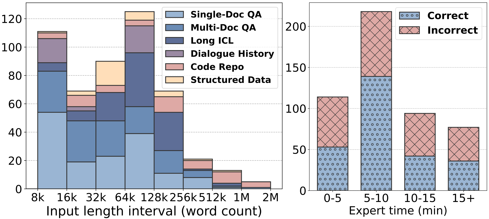
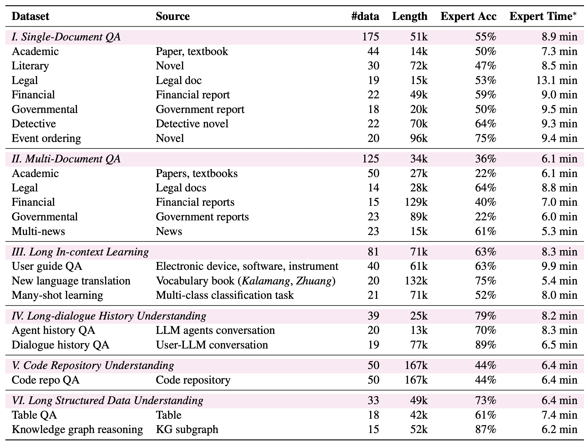

# 📚 LongBench v2: Towards Deeper Understanding and Reasoning on Realistic Long-context Multitasks
<p align="center">
    🌐 <a href="https://longbench2.github.io" target="_blank">Project Page</a> • 📚 <a href="https://arxiv.org/abs/2412.15204" target="_blank">LongBench v2 Paper</a> • 📊 <a href="https://huggingface.co/datasets/THUDM/LongBench-v2" target="_blank">LongBench v2 Dataset</a> • 𝕏 <a href="https://x.com/realYushiBai/status/1869946577349132766" target="_blank">Thread</a>
</p>
<p align="center">
    📖 <a href="https://arxiv.org/abs/2308.14508" target="_blank">LongBench Paper</a> • 🤗 <a href="https://huggingface.co/datasets/THUDM/LongBench" target="_blank">LongBench Dataset</a>
</p>

**📢 The original LongBench v1 related files are moved under `LongBench/`, read its README [here](LongBench/README.md)**.

LongBench v2 is designed to assess the ability of LLMs to handle long-context problems requiring **deep understanding and reasoning** across real-world multitasks. LongBench v2 has the following features: (1) **Length**: Context length ranging from 8k to 2M words, with the majority under 128k. (2) **Difficulty**: Challenging enough that even human experts, using search tools within the document, cannot answer correctly in a short time. (3) **Coverage**: Cover various realistic scenarios. (4) **Reliability**: All in a multiple-choice question format for reliable evaluation.

To elaborate, LongBench v2 consists of 503 challenging multiple-choice questions, with contexts ranging from 8k to 2M words, across six major task categories: single-document QA, multi-document QA, long in-context learning, long-dialogue history understanding, code repo understanding, and long structured data understanding. To ensure the breadth and the practicality, we collect data from nearly 100 highly educated individuals with diverse professional backgrounds. We employ both automated and manual review processes to maintain high quality and difficulty, resulting in human experts achieving only 53.7% accuracy under a 15-minute time constraint. Our evaluation reveals that the best-performing model, when directly answers the questions, achieves only 50.1% accuracy. In contrast, the o1-preview model, which includes longer reasoning, achieves 57.7%, surpassing the human baseline by 4%. These results highlight the importance of **enhanced reasoning ability and scaling inference-time compute to tackle the long-context challenges in LongBench v2**.

**🔍 With LongBench v2, we are eager to find out how scaling inference-time compute will affect deep understanding and reasoning in long-context scenarios. View our 🏆 leaderboard [here](https://longbench2.github.io/#leaderboard) (updating).**

<div style="text-align: center;">
  
</div>

<div style="text-align: center;">
  
</div>

## 🔥 Updates
🔥🔥🔥 **[2024/01/15]** More evaluation results added to our [leaderboard](https://longbench2.github.io/#leaderboard), including Gemini-Exp-1206, Gemini-2.0-Flash, DeepSeek-V3, and MiniMax-Text-01, Check them out!

🔥🔥🔥 **[2024/12/20]** We are excited to release **LongBench v2**! Compared to the first generation of LongBench, LongBench v2 is much longer and much more challenging. Its goal is to provide a reliable evaluation standard for the development of future superhuman long-context AI systems.

## ⚙️ How to evaluate on LongBench v2

### Load Data
You can download and load the **LongBench v2** data through the Hugging Face datasets ([🤗 HF Repo](https://huggingface.co/datasets/THUDM/LongBench-v2)):
```python
from datasets import load_dataset
dataset = load_dataset('THUDM/LongBench-v2', split='train')
```
Alternatively, you can download the file from [this link](https://huggingface.co/datasets/THUDM/LongBench-v2/resolve/main/data.json) to load the data.

### Data Format

All data in **LongBench v2** are standardized to the following format:

```json
{
    "_id": "Unique identifier for each piece of data",
    "domain": "The primary domain category of the data",
    "sub_domain": "The specific sub-domain category within the domain",
    "difficulty": "The difficulty level of the task, either 'easy' or 'hard'",
    "length": "The length category of the task, which can be 'short', 'medium', or 'long'",
    "question": "The input/command for the task, usually short, such as questions in QA, queries in many-shot learning, etc",
    "choice_A": "Option A", "choice_B": "Option B", "choice_C": "Option C", "choice_D": "Option D",
    "answer": "The groundtruth answer, denoted as A, B, C, or D",
    "context": "The long context required for the task, such as documents, books, code repositories, etc."
}
```

### Evaluation
Install the requirements with pip: `pip install -r requirements.txt`.

To run model evaluation, first add your model path and its context window length to `config/`, then follow these steps (we take [GLM-4-9B-Chat](https://github.com/THUDM/GLM-4) for a running example):

#### Step 1: Deploy the Model with vLLM

First, deploy your model using [vLLM](https://docs.vllm.ai/en/latest/serving/openai_compatible_server.html). Run the following command to serve the model:

```bash
vllm serve THUDM/glm-4-9b-chat --api-key token-abc123 --tensor-parallel-size 4 --gpu-memory-utilization 0.95 --max_model_len 131072 --trust-remote-code
```

- `--tensor-parallel-size 4` specifies the number of tensor parallelism slices. It should be set to higher value, i.e., 8, to serve larger models such as [Llama-3.1-70B-Instruct](https://huggingface.co/meta-llama/Llama-3.1-70B-Instruct) or [Qwen2.5-72B-Instruct](https://huggingface.co/Qwen/Qwen2.5-72B-Instruct).
- Adjust `--gpu-memory-utilization` to control GPU memory usage.
- Set `--max_model_len` to the context window length of the model.

#### Step 2: Run Model Inference

Once your model is deployed, modify the `URL` and `API_KEY` in `pred.py` to match your serving instance. Run the model inference with the following command:

```bash
python pred.py --model GLM-4-9B-Chat
```
- `--cot`: Enable evaluation under the Chain-of-Thought (CoT) setting.
- `--no_context`: Test the model’s performance without the long context (pure memorization).
- `--rag N`: Use top-N retrieved contexts during +RAG evaluation. This is set to 0 by default to disable RAG. For details on the retrieval process, refer to the [retrieve.py](https://github.com/THUDM/LongCite/blob/main/utils/retrieve.py) file.

#### Step 3: Export Results

Finally, run `python result.py` to export the evaluation results.

## 📝 Citation
```
@article{bai2024longbench2,
  title={LongBench v2: Towards Deeper Understanding and Reasoning on Realistic Long-context Multitasks}, 
  author={Yushi Bai and Shangqing Tu and Jiajie Zhang and Hao Peng and Xiaozhi Wang and Xin Lv and Shulin Cao and Jiazheng Xu and Lei Hou and Yuxiao Dong and Jie Tang and Juanzi Li},
  journal={arXiv preprint arXiv:2412.15204},
  year={2024}
}
@inproceedings{bai2024longbench,
    title = "{L}ong{B}ench: A Bilingual, Multitask Benchmark for Long Context Understanding",
    author = "Bai, Yushi and Lv, Xin  and Zhang, Jiajie  and Lyu, Hongchang  and
      Tang, Jiankai  and Huang, Zhidian  and Du, Zhengxiao  and Liu, Xiao  and Zeng, Aohan  and Hou, Lei  and Dong, Yuxiao  and Tang, Jie  and Li, Juanzi",
    booktitle = "Proceedings of the 62nd Annual Meeting of the Association for Computational Linguistics (Volume 1: Long Papers)",
    month = aug,
    year = "2024",
    address = "Bangkok, Thailand",
    publisher = "Association for Computational Linguistics",
    url = "https://aclanthology.org/2024.acl-long.172",
    doi = "10.18653/v1/2024.acl-long.172",
    pages = "3119--3137",
}
```
