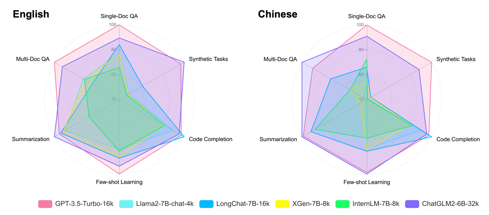
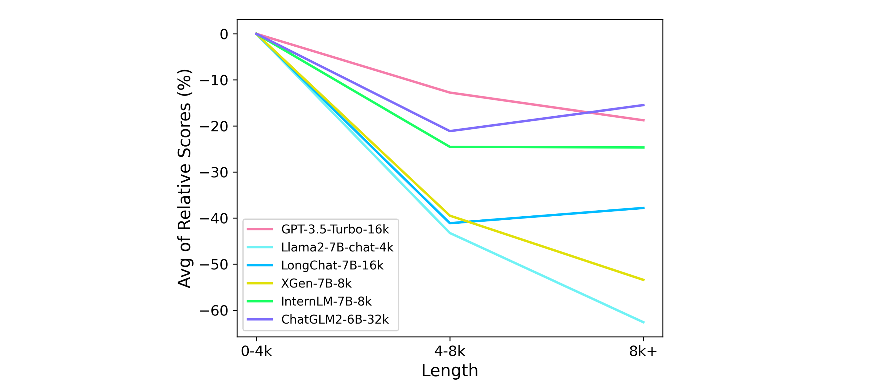

<p align="center">
    🤗 <a href="https://huggingface.co/datasets/THUDM/LongBench" target="_blank">HF Repo</a> • 📃 <a href="https://arxiv.org/abs/2308.14508" target="_blank">Paper</a>
</p>

阅读[中文版本](README_ZH.md).

# 📖 LongBench: A Bilingual, Multitask Benchmark for Long Context Understanding

**LongBench** is the first benchmark for bilingual, multitask, and comprehensive assessment of **long context understanding** capabilities of large language models. LongBench includes different languages (Chinese and English) to provide a more comprehensive evaluation of the large models' multilingual capabilities on long contexts. In addition, LongBench is composed of six major categories and twenty one different tasks, covering key long-text application scenarios such as single-document QA, multi-document QA, summarization, few-shot learning, synthetic tasks and code completion.

We are fully aware of the potentially high costs involved in the model evaluation process, especially in the context of long context scenarios (such as manual annotation costs or API call costs). Therefore, we adopt a fully automated evaluation method, aimed at measuring and evaluating the model's ability to understand long contexts at the lowest cost.

LongBench includes 14 English tasks, 5 Chinese tasks, and 2 code tasks, with the average length of most tasks ranging from 5k to 15k, and a total of 4,750 test data. For detailed statistics and construction methods of LongBench tasks, please refer [here](task.md). In addition, we provide LongBench-E, a test set with a more uniform length distribution constructed by uniform sampling, with comparable amounts of data in the 0-4k, 4k-8k, and 8k+ length intervals to provide an analysis of the model's performance variations at different input lengths.


| Task Type | \#English Task | \#Chinese Task | \#Code Task |
| :-------: | :--------------------: | :--------------------: | :------------------: |
| Multi-document QA | 3 | 1 | - |
| Single-document QA | 3 | 1 | - |
| Summarization | 3 | 1 | - |
| Few-shot learning | 3 | 1 | - |
| Synthetic Tasks | 2 | 1 | - |
| Code Completion | - | - | 2 |

## 🔥 Updates
**[2024/02/01]** Check out our new effort in Long context LLMs: [LongAlign](https://arxiv.org/abs/2401.18058). We explore the best recipe for long context alignment. We also propose [LongBench-Chat](https://github.com/THUDM/LongAlign), the first real-world long context evaluation benchmark (10k-100k input length). We also release an instruction-following dataset at [HF Dataset](https://huggingface.co/datasets/THUDM/LongAlign-10k), along with a suite of competitive long context LLMs trained with LongAlign!

**[2023/10/30]** The new [ChatGLM3-6B-32k](https://huggingface.co/THUDM/chatglm3-6b-32k) chat model is out, with better proficiency at long context modeling and is especially good at long document based question answering, reasoning and summarization. Check out its [performance](#leaderboard) on LongBench.

**[2023/08/29]** The [LongBench paper](https://arxiv.org/abs/2308.14508) is released, along with several important updates to LongBench:
1. **More comprehensive datasets**: The MultiNews dataset for multi-document summarization is added to the summarization tasks, and the summarization task SAMSum is added to the Few-shot learning tasks, replacing the previous QA task NQ. TriviaQA and RepoBench-P are resampled to ensure a more appropriate data length;
2. **More uniformed length distribution**: LongBench-E is obtained by uniform sampling according to length, featuring a comparable amount of test data in the length intervals of 0-4k, 4-8k, and 8k+, which is more suitable for evaluating the model's ability in different input lengths variation;
3. **All evaluation codes made public**: The code for evaluating all models has been made public, and the code for retrieval-based and summarization-based long context compression strategies are also provided.

## 🔍 Table of Contents
- [🖥️ Leaderboard](#leaderboard)
- [⚙️ How to evaluate on LongBench](#how-to-evaluate-on-LongBench)
- [📊 Evaluation Result on Each Dataset](#evaluation-result-on-each-dataset)
- [📄 Acknowledgement](#acknowledgement)
- [📝 Citation](#citation)
  
<a name="leaderboard"></a>
## 🖥️ Leaderboard
Here is the average scores (%) on the main task categories in both Chinese and English languages under the Zero-shot scenario. Please refer to this [link](task.md) for the evaluation metrics used for each task.

> Note: For text exceeding the processing length capability of the model, we truncate from the middle of the text, preserving information from the beginning and end, in accordance with the observations from [Lost in the Middle](https://arxiv.org/abs/2307.03172). Experiments show that this truncation method has the least impact on model performance.

#### English
|                   | Avg  | Single-Doc QA | Multi-Doc QA | Summarization | Few-shot Learning | Code Completion | Synthetic Tasks |
| ----------------- | :--: | :-----------: | :----------: | :-----------: | :---------------: | :-------------: | :-------------: |
| GPT-3.5-Turbo-16k | 44.0 | 39.8 | 38.7 | 26.5 | 67.1 | 54.1 | 37.8 |
| Llama2-7B-chat-4k | 31.0 | 24.9 | 22.6 | 24.7 | 60.0 | 48.1 | 5.9 |
| LongChat-v1.5-7B-32k | 34.3 | 28.7 | 20.6 | 26.7 | 60.0 | 54.1 | 15.8 |
| XGen-7B-8k | 28.3 | 24.6 | 20.4 | 24.7 | 56.2 | 38.6 | 5.3 |
| InternLM-7B-8k | 24.2 | 17.4 | 20.2 | 16.1 | 50.3 | 36.4 | 4.5 |
| ChatGLM2-6B-32k | 40.9 | 32.9 | 33.7 | 27.6 | 59.1 | 52.7 | 39.2 |
| Vicuna-v1.5-7B-16k | 31.9 | 28.0 | 18.6 | 26.0 | 66.2 | 47.3 | 5.5 |
| ChatGLM3-6B-32k | 48.5 | 40.3 | 46.6 | 29.5 | 68.1 | 56.2 | 50.5 |

#### Chinese

|                   | Avg  | Single-Doc QA | Multi-Doc QA | Summarization | Few-shot Learning | Code Completion | Synthetic Tasks |
| ----------------- | :--: | :-----------: | :----------: | :-----------: | :---------------: | :-------------: | :-------------: |
| GPT-3.5-Turbo-16k | 44.5 | 61.2 | 28.7 | 16.0 | 29.2 | 54.1 | 77.5 |
| Llama2-7B-chat-4k | 14.3 | 11.9 | 5.2 | 0.2 | 19.8 | 48.1 | 0.5 |
| LongChat-v1.5-7B-32k | 23.9 | 29.1 | 19.5 | 9.9 | 23.2 | 54.1 | 7.6 |
| XGen-7B-8k | 15.1 | 14.8 | 11.0 | 2.2 | 20.5 | 38.6 | 3.5 |
| InternLM-7B-8k | 18.3 | 33.6 | 11.1 | 12.4 | 15.2 | 36.4 | 0.9 |
| ChatGLM2-6B-32k | 41.7 | 51.6 | 37.6 | 16.2 | 27.7 | 52.7 | 64.5 |
| Vicuna-v1.5-7B-16k | 26.4 | 43.0 | 19.3 | 15.1 | 28.8 | 47.3 | 5.0 |
| ChatGLM3-6B-32k | 52.8 | 62.3 | 44.8 | 17.8 | 42.0 | 56.2 | 94.0 |

#### Radar Chart on Long Context Capability


#### Variation of Abilities under Different Context Lengths
To specifically analyze the model's performance under different context lengths, the following chart shows the models' total scores averaged across all tasks by task category over different context length intervals in LongBench-E.



<a name="how-to-evaluate-on-LongBench"></a>
## ⚙️ How to evaluate on LongBench

#### Load Data
You can download and load the **LongBench** data through the Hugging Face datasets ([🤗 HF Repo](https://huggingface.co/datasets/THUDM/LongBench)):
```python
from datasets import load_dataset

datasets = ["narrativeqa", "qasper", "multifieldqa_en", "multifieldqa_zh", "hotpotqa", "2wikimqa", "musique", \
            "dureader", "gov_report", "qmsum", "multi_news", "vcsum", "trec", "triviaqa", "samsum", "lsht", \
            "passage_count", "passage_retrieval_en", "passage_retrieval_zh", "lcc", "repobench-p"]

for dataset in datasets:
    data = load_dataset('THUDM/LongBench', dataset, split='test')
```
Similarly, you can load the **LongBench-E** data
```python
from datasets import load_dataset

datasets = ["qasper", "multifieldqa_en", "hotpotqa", "2wikimqa", "gov_report", "multi_news", "trec", \
            "triviaqa", "samsum", "passage_count", "passage_retrieval_en", "lcc", "repobench-p"]

for dataset in datasets:
    data = load_dataset('THUDM/LongBench', f"{dataset}_e", split='test')
```
Alternatively, you can download the folder from [this link](https://huggingface.co/datasets/THUDM/LongBench/resolve/main/data.zip) to load the data.

#### Data Format

All data in **LongBench** (LongBench-E) are standardized to the following format:

```json
{
    "input": "The input/command for the task, usually short, such as questions in QA, queries in Few-shot tasks, etc",
    "context": "The long context required for the task, such as documents, cross-file code, few-shot examples in Few-shot tasks",
    "answers": "A List of all true answers",
    "length": "Total length of the first three items (counted in characters for Chinese and words for English)",
    "dataset": "The name of the dataset to which this piece of data belongs",
    "language": "The language of this piece of data",
    "all_classes": "All categories in classification tasks, null for non-classification tasks",
    "_id": "Random id for each piece of data"
}
```

#### Evaluation
Install the requirements with pip: `pip install -r requirements.txt`. For Llama-2 based models, we recommend using Flash Attention for optimization and saving GPU memory The relevant dependencies can be installed according to the code base of [Flash Attention](https://github.com/Dao-AILab/flash-attention).

First, run [pred.py](pred.py) and select the model you want to evaluate via `--model`. Let's take ChatGLM3-6B-32k as an example (HuggingFace model weight will be downloaded automatically according to the path in [model2path.json](config/model2path.json), you can change the path in this file to load the model weight from local):
```bash
CUDA_VISIBLE_DEVICES=0 python pred.py --model chatglm3-6b-32k
```
You can also run inference on multi-gpus in parallel (one model per gpu):
```bash
CUDA_VISIBLE_DEVICES=0,1,2,3 python pred.py --model chatglm3-6b-32k
```
You can obtain the output of the model under all LongBench datasets under the `pred/` folder corresponding to the model name. Similarly, with the `--e` command:
```bash
CUDA_VISIBLE_DEVICES=0 python pred.py --model chatglm3-6b-32k --e
```
You can obtain the output on LongBench-E under the `pred_e/` folder. After that, run the evaluation code in [eval.py](eval.py):
```bash
python eval.py --model chatglm3-6b-32k
```
You can get the evaluation results on all datasets in `result.json`. The average score of the model over different length intervals in all LongBench-E datasets can be obtained with the `--e` command.

Please note that in `config/`, we provide the input format suitable for each dataset and the maximum output length. Feel free to modify them to better suit the model you want to evaluate. After modification, when evaluating with [pred.py](pred.py), the data will be automatically organized according to the new format to get the corresponding model output.

In addition we provide the code for the long context compression evaluation based on retrieval and summarization (see Section 4.2 in the LongBench paper for the implementation details) in the folders `retrieval/` and `summ/`, respectively.

<a name="evaluation-result-on-each-dataset"></a>
## 📊 Evaluation Result on Each Dataset

The following tables show the Zero-shot evaluation results (%) on all datasets, where Chinese datasets are denoted by "zh" (please refer to this [link](task.md) for the evaluation metrics used for each task).

#### Single-Document QA
|                   | NarrativeQA | Qasper | MultiFieldQA-en | MultiFieldQA-zh |
| ----------------- | :---------: | :----: | :-------------: | :-------------: |
| GPT-3.5-Turbo-16k | 23.6 | 43.3 | 52.3 | 61.2 |
| Llama2-7B-chat-4k | 18.7 | 19.2 | 36.8 | 11.9 |
| LongChat-v1.5-7B-32k | 16.9 | 27.7 | 41.4 | 29.1 |
| XGen-7B-8k | 18.0 | 18.1 | 37.7 | 14.8 |
| InternLM-7B-8k | 12.1 | 16.7 | 23.4 | 33.6 |
| ChatGLM2-6B-32k | 21.1 | 31.5 | 46.2 | 51.6 |
| Vicuna-v1.5-7B-16k | 19.4 | 26.1 | 38.5 | 43.0 |
| ChatGLM3-6B-32k | 26.0 | 43.3 | 51.7 | 62.3 |

#### Multi-Document QA
|                   | HotpotQA | 2WikiMQA | Musique | DuReader (zh) |
| ----------------- | :------: | :------: | :-----: | :-----------: |
| GPT-3.5-Turbo-16k | 51.6 | 37.7 | 26.9 | 28.7 |
| Llama2-7B-chat-4k | 25.4 | 32.8 | 9.4 | 5.2 |
| LongChat-v1.5-7B-32k | 31.5 | 20.6 | 9.7 | 19.5 |
| XGen-7B-8k | 29.7 | 21.1 | 10.3 | 11.0 |
| InternLM-7B-8k | 28.7 | 22.8 | 9.0 | 11.1 |
| ChatGLM2-6B-32k | 45.1 | 34.0 | 21.9 | 37.6 |
| Vicuna-v1.5-7B-16k | 25.3 | 20.8 | 9.8 | 19.3 |
| ChatGLM3-6B-32k | 54.4 | 44.9 | 40.4 | 44.78 |

#### Summarization
|            | GovReport | QMSum | MultiNews | VCSUM (zh) |
|:-----------|:---------:|:-----:|:-----:|:-----:|
| GPT-3.5-Turbo-16k | 29.5 | 23.4 | 26.7 | 16.0 |
| Llama2-7B-chat-4k | 27.3 | 20.8 | 25.8 | 0.2 |
| LongChat-v1.5-7B-32k | 30.8 | 22.7 | 26.4 | 9.9 |
| XGen-7B-8k | 27.3 | 20.5 | 26.2 | 2.2 |
| InternLM-7B-8k | 9.7 | 15.9 | 22.8 | 12.4 |
| ChatGLM2-6B-32k | 32.4 | 24.0 | 26.5 | 16.2 |
| Vicuna-v1.5-7B-16k | 27.9 | 22.8 | 27.2 | 15.1 |
| ChatGLM3-6B-32k | 36.8 | 23.9 | 27.9 | 17.8 |

#### Few-shot Learning
|     | TREC | TriviaQA | SAMSum | LSHT (zh) |
| --- | :-: | :-: | :-: | :-: |
| GPT-3.5-Turbo-16k | 68.0 | 91.4 | 41.7 | 29.2 |
| Llama2-7B-chat-4k | 61.5 | 77.8 | 40.7 | 19.8 |
| LongChat-v1.5-7B-32k | 63.5 | 82.3 | 34.2 | 23.2 |
| XGen-7B-8k | 65.5 | 77.8 | 25.3 | 20.5 |
| InternLM-7B-8k | 52.0 | 77.8 | 21.2 | 15.2 |
| ChatGLM2-6B-32k | 62.5 | 78.7 | 36.3 | 27.7 |
| Vicuna-v1.5-7B-16k | 71.5 | 86.2 | 40.8 | 28.8 |
| ChatGLM3-6B-32k | 79.0 | 87.1 | 38.2 | 42.0 |

#### Synthetic Tasks
|     | Passage Count | PassageRetrieval-en | PassageRetrieval-zh |
| --- | :-: | :-: | :-: |
| GPT-3.5-Turbo-16k | 4.5 | 71.0 | 77.5 |
| Llama2-7B-chat-4k | 2.1 | 9.8 | 0.5 |
| LongChat-v1.5-7B-32k | 1.0 | 30.5 | 7.6 |
| XGen-7B-8k | 2.1 | 8.5 | 3.5 |
| InternLM-7B-8k | 3.0 | 6.0 | 0.9 |
| ChatGLM2-6B-32k | 1.5 | 77.0 | 64.5 |
| Vicuna-v1.5-7B-16k | 6.5 | 4.5 | 5.0 |
| ChatGLM3-6B-32k | 2.0 | 99.0 | 94.0 |

#### Code Completion
|     | LCC | RepoBench-P |
| --- | :-: | :-: |
| GPT-3.5-Turbo-16k | 54.7 | 53.6 |
| Llama2-7B-chat-4k | 52.4 | 43.8 |
| LongChat-v1.5-7B-32k | 53.0 | 55.3 |
| XGen-7B-8k | 38.6 | 38.6 |
| InternLM-7B-8k | 44.1 | 28.8 |
| ChatGLM2-6B-32k | 55.6 | 49.9 |
| Vicuna-v1.5-7B-16k | 51.0 | 43.5 |
| ChatGLM3-6B-32k | 57.66 | 54.76 |

<a name="acknowledgement"></a>
## 📄 Acknowledgement

- Some of the tasks of LongBench are based on the datasets proposed by previous researchers, including [HotpotQA](https://hotpotqa.github.io/), [2WikiMultihopQA](https://aclanthology.org/2020.coling-main.580/), [MuSiQue](https://arxiv.org/abs/2108.00573), [DuReader](https://github.com/baidu/DuReader), [NarrativeQA](https://arxiv.org/pdf/1712.07040.pdf), [Qasper](https://arxiv.org/pdf/2105.03011.pdf), [GovReport](https://arxiv.org/pdf/2104.02112.pdf), [QMSum](https://arxiv.org/pdf/2104.05938.pdf), [MultiNews](https://aclanthology.org/P19-1102.pdf)，[VCSUM](https://arxiv.org/abs/2305.05280), [TriviaQA](https://nlp.cs.washington.edu/triviaqa/), [TREC](https://aclanthology.org/C02-1150.pdf), [SAMSum](https://aclanthology.org/D19-5409.pdf)，[LSHT](http://tcci.ccf.org.cn/conference/2014/dldoc/evatask6.pdf), [LCC](https://arxiv.org/abs/2306.14893) and [RepoBench-P](https://arxiv.org/abs/2306.03091).

<a name="citation"></a>
## 📝 Citation
```
@article{bai2023longbench,
  title={LongBench: A Bilingual, Multitask Benchmark for Long Context Understanding},
  author={Bai, Yushi and Lv, Xin and Zhang, Jiajie and Lyu, Hongchang and Tang, Jiankai and Huang, Zhidian and Du, Zhengxiao and Liu, Xiao and Zeng, Aohan and Hou, Lei and Dong, Yuxiao and Tang, Jie and Li, Juanzi},
  journal={arXiv preprint arXiv:2308.14508},
  year={2023}
}
```
When citing our work, please kindly consider citing the original dataset papers. The relevant citation information is listed [here](refs/ref.bib).
